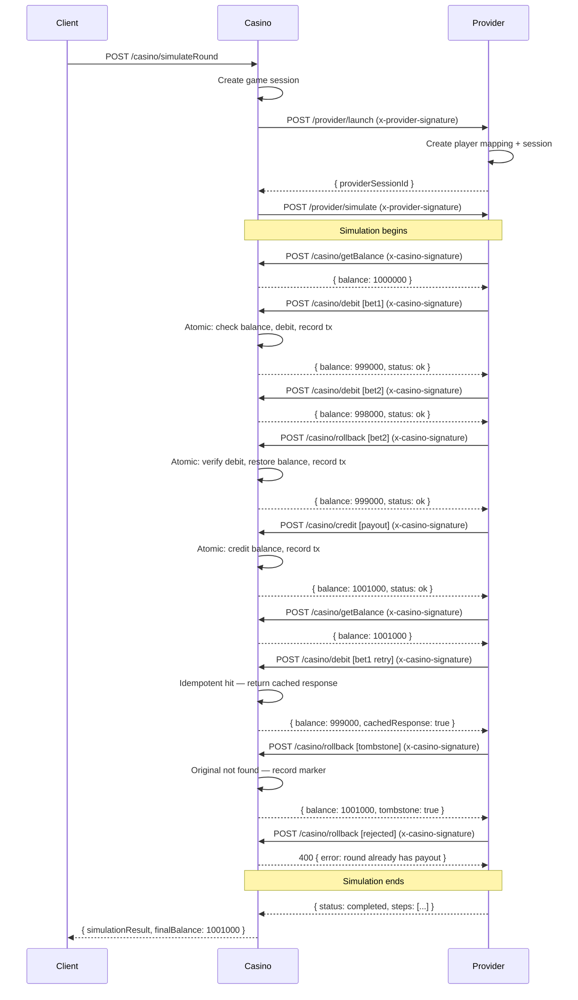

# Casino & Game Provider Integration

Bidirectional API integration between an online Casino Platform and an external Game Provider (Jaqpot Games). Both systems coexist in a single codebase with logical separation: namespaced endpoints (`/casino/*`, `/provider/*`) and prefixed database tables (`casino_*`, `provider_*`).

The Casino is the **sole source of truth** for wallet balances. The Provider never reads or writes balances directly — all balance mutations happen exclusively through signed Casino callback APIs (`/casino/debit`, `/casino/credit`, `/casino/rollback`). Every money-moving operation is **atomic** (Prisma interactive transactions) and **strictly idempotent** (unique `external_transaction_id` per request with cached responses).

## Tech Stack

- **Runtime:** Node.js v18+
- **Language:** TypeScript
- **Framework:** Express.js
- **Database:** PostgreSQL
- **ORM:** Prisma 7
- **Package Manager:** pnpm

## Setup

```bash
# 1. Install dependencies
pnpm install

# 2. Configure environment
cp .env.example .env
# Edit .env with your PostgreSQL credentials if needed

# 3. Generate Prisma client
pnpm prisma:generate

# 4. Run database migrations
pnpm prisma:migrate

# 5. Seed demo data (2 users, 2 games, provider config)
pnpm seed

# 6. Start the server
pnpm dev
```

## Environment Variables

| Variable          | Description                        |
|-------------------|------------------------------------|
| `DATABASE_URL`    | PostgreSQL connection string       |
| `PORT`            | Server port (default: `3000`)      |
| `CASINO_SECRET`   | HMAC secret for casino callbacks   |
| `PROVIDER_SECRET` | HMAC secret for provider endpoints |

## Run a Full Simulation

With the server running:

```bash
pnpm simulate
```

Or with curl:

```bash
curl -X POST http://localhost:3000/casino/simulateRound \
  -H "Content-Type: application/json" \
  -d '{"userId": 1, "gameId": 1, "currency": "USD"}'
```

### Expected Simulation Output

Starting balance: `1,000,000` cents ($10,000.00)

| Step | Action | Amount | Balance After | Validates |
|------|--------|--------|---------------|-----------|
| 1 | Balance check | -- | 1,000,000 | Read-only query |
| 2 | Bet 1 (debit) | -1,000 | 999,000 | Atomic debit |
| 3 | Bet 2 (debit) | -1,000 | 998,000 | Atomic debit |
| 4 | Rollback bet 2 | +1,000 | 999,000 | Reversal of bet 2 |
| 5 | Payout (credit) | +2,000 | 1,001,000 | 2x bet 1 winnings |
| 6 | Final balance check | -- | 1,001,000 | Confirms integrity |
| 7 | Idempotency retry (bet 1) | 0 | 1,001,000 | Cached response, no double-charge |
| 8 | Tombstone rollback | 0 | 1,001,000 | Marker for non-existent original |
| 9 | Rejected rollback | -- | 1,001,000 | Denied: round has payout |

Final balance: `1,001,000` cents ($10,010.00) — net profit of $10.00.

## API Endpoints

### Casino APIs

| Endpoint | Description | Auth |
|----------|-------------|------|
| `POST /casino/launchGame` | Validates player/wallet, creates session, calls `/provider/launch` | None (client) |
| `POST /casino/simulateRound` | Orchestrates launch + full provider simulation | None (client) |
| `POST /casino/getBalance` | Returns authoritative player balance (read-only) | HMAC `x-casino-signature` |
| `POST /casino/debit` | Deducts funds for a bet (atomic, idempotent) | HMAC `x-casino-signature` |
| `POST /casino/credit` | Credits funds for a payout (atomic, idempotent) | HMAC `x-casino-signature` |
| `POST /casino/rollback` | Reverses a previously accepted bet (atomic, idempotent) | HMAC `x-casino-signature` |

### Provider APIs

| Endpoint | Description | Auth |
|----------|-------------|------|
| `POST /provider/launch` | Creates provider-side session and player mapping | HMAC `x-provider-signature` |
| `POST /provider/simulate` | Runs scripted demo round calling casino callbacks | HMAC `x-provider-signature` |

## Security Model (HMAC-SHA256)

Each direction of communication uses its own dedicated secret and header:

| Direction | Header | Secret |
|-----------|--------|--------|
| Provider -> Casino (`/casino/*`) | `x-casino-signature` | `CASINO_SECRET` |
| Casino -> Provider (`/provider/*`) | `x-provider-signature` | `PROVIDER_SECRET` |

The request body is serialized with `JSON.stringify()` and signed using HMAC-SHA256. Verification uses `crypto.timingSafeEqual()` for constant-time comparison, preventing timing attacks.

## Idempotency

All money-moving endpoints (`/casino/debit`, `/casino/credit`, `/casino/rollback`) enforce strict idempotency:

- Each request carries a unique `transactionId` generated by the Provider.
- Before processing, the Casino checks `casino_transactions.external_transaction_id` (UNIQUE constraint).
- If found, the original cached response (`response_cache` JSONB column) is returned immediately — no balance mutation occurs.
- If not found, the transaction is processed atomically and the response is cached.

This guarantees that provider retries (due to timeouts or network errors) never cause double-charges or double-payouts. The simulation can be safely re-run since each invocation generates new UUIDs for all transaction IDs.

## Rollback Rules

- **Only bets (debits) can be rolled back.** Attempting to rollback a credit returns HTTP 400.
- **No rollback after payout.** If the round already has a credit transaction, rollback is denied with HTTP 400.
- **Tombstone rule:** If the original bet transaction cannot be found, a rollback marker is recorded with `amount=0` and the response includes `"tombstone": true`. Balance remains unchanged. This provides auditability and prevents inconsistent retry behavior.
- **Idempotent:** Duplicate rollback requests (same `transactionId`) return the cached first response.

## Full Round Flow



## Design Decisions

- **Single codebase:** As specified by the test. Both domains remain logically isolated — Casino never writes to `provider_*` tables and vice versa. All cross-domain communication happens through HTTP.
- **PostgreSQL:** Required by the test. BigInt columns store monetary values in cents to avoid floating-point precision issues.
- **Atomic transactions:** All wallet mutations run inside Prisma interactive transactions (`$transaction`). Balance read + update + ledger insert succeed or fail as a unit, preventing partial writes.
- **Idempotency is mandatory:** In gaming and fintech systems, network failures and retries are expected. Without idempotency, a retried debit could double-charge a player. The `external_transaction_id` UNIQUE constraint combined with response caching eliminates this risk entirely.
